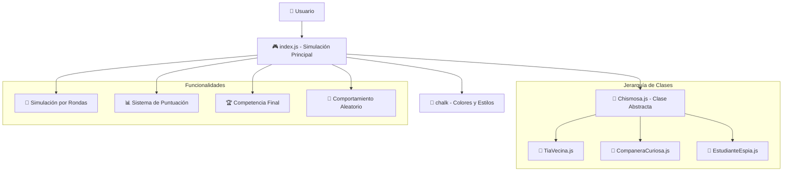
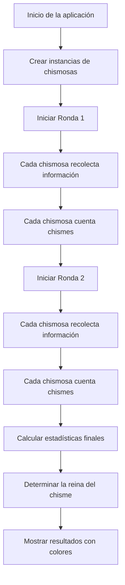

# 👑 Gossip Queens - Node.js
<p align="center"> 
   
</p>

<p align="center"> 
  
  
  
  
  
  
</p>

> 👑 Gossip Queens es una simulación de consola desarrollada con Node.js que simula el comportamiento de diferentes tipos de "chismosas" en un entorno social. 💻 Este proyecto demuestra conceptos avanzados de programación orientada a objetos como clases abstractas, herencia, encapsulación y polimorfismo. 📚 Tres tipos de chismosas compiten por ser la reina del chisme: Tía Vecina, Compañera Curiosa y Estudiante Espía, cada una con sus propias estrategias y características únicas

---

## 📑 Tabla de Contenidos

| Sección | Descripción |
|---------|-------------|
| [🎯 Características](#-características) | Funcionalidades principales de la aplicación |
| [📋 Descripción del Problema](#-descripción-del-problema) | Problemática que resuelve la aplicación |
| [📁 Estructura de Archivos](#-estructura-de-archivos) | Organización del proyecto |
| [🛠️ Librerías Utilizadas](#️-librerías-utilizadas-con-links-oficiales) | Detalles de las dependencias NPM |
| [🔧 Explicación Detallada de la Implementación](#-explicación-detallada-de-la-implementación) | Arquitectura y código del sistema |
| [📊 Ejemplos de Uso Completos](#-ejemplos-de-uso-completos) | Casos de uso prácticos |
| [🚀 Instrucciones de Instalación y Uso](#-instrucciones-claras-de-instalación-y-uso) | Guía completa de instalación |
| [🛠️ Solución de Problemas](#️-solución-de-problemas-comunes) | Troubleshooting y errores comunes |
| [🔮 Posibles Mejoras Futuras](#-posibles-mejoras-futuras) | Roadmap del proyecto |
| [🎓 Aprendizajes del Proyecto](#-aprendizajes-del-proyecto) | Conceptos demostrados |

---

## 🎯 Características

- **👑 Simulación de Chismosas**: Tres tipos únicos de chismosas con comportamientos distintos
- **🏗️ Programación Orientada a Objetos**: Implementación de clases abstractas, herencia y encapsulación
- **🎨 Interfaz Colorida**: Usa chalk.js para una experiencia visual atractiva en consola
- **📊 Sistema de Puntuación**: Reputación y nivel de chisme que evolucionan dinámicamente
- **🔄 Simulación por Rondas**: Múltiples rondas de recolección y difusión de chismes
- **🏆 Competencia**: Sistema que determina la "Reina del Chisme" basado en estadísticas
- **🎲 Comportamiento Aleatorio**: Elementos de azar que hacen cada ejecución única

---

## 📋 Descripción del Problema

### **Problemática Principal: Enseñanza de Programación Orientada a Objetos**

En el aprendizaje de programación orientada a objetos, los estudiantes a menudo luchan con conceptos abstractos como herencia, polimorfismo y encapsulación. Este proyecto aborda esta problemática mediante una simulación divertida y práctica que demuestra estos conceptos de manera tangible.

#### **1. Conceptos POO Difíciles de Visualizar**

Los conceptos fundamentales de POO pueden ser abstractos y difíciles de entender:

```javascript
// ❌ Ejemplo abstracto tradicional:
class Animal {
    makeSound() { throw new Error("Must implement"); }
}
class Dog extends Animal {
    makeSound() { return "Woof"; }
}

// ✅ Nuestro enfoque práctico:
class Chismosa {
    recolectarInfo() { throw new Error("Must implement"); }
    contarChisme() { throw new Error("Must implement"); }
}
class TiaVecina extends Chismosa {
    recolectarInfo() { console.log("👵 Aprovecha la reunión del barrio..."); }
}
```

#### **2. Falta de Contexto Real en Ejemplos Educativos**

Los ejemplos tradicionales de POO carecen de contexto social:

- **Animales**: Demasiado abstracto, no conecta con experiencias reales
- **Formas geométricas**: Matemáticamente correcto pero aburrido
- **Vehiculos**: Técnico pero sin emoción
- **Chismosas**: ¡Relatable, divertido y memorable! 😄

#### **3. Casos de Uso Específicos que Resuelve Esta Aplicación**

**Problema 1: Clases Abstractas Difíciles de Entender**
```javascript
// ❌ Explicación teórica confusa:
// "Una clase abstracta no puede ser instanciada directamente"

// ✅ Demostración práctica:
class Chismosa {
    constructor(nombre) {
        if (new.target === Chismosa) {
            throw new Error("La clase Chismosa es abstracta y no puede ser instanciada directamente.");
        }
    }
}
// new Chismosa("Test"); // ❌ Error! Demuestra el concepto inmediatamente
```

**Problema 2: Polimorfismo Abstracto**
```javascript
// ❌ Ejemplo genérico:
// "El polimorfismo permite que objetos de diferentes clases respondan al mismo mensaje"

// ✅ Nuestro ejemplo concreto:
chismosas.forEach(ch => {
    ch.recolectarInfo();  // Cada tipo hace algo diferente pero con la misma interfaz
    ch.contarChisme();    // Tía Vecina vs Compañera Curiosa vs Estudiante Espía
});
```

**Problema 3: Encapsulación Invisible**
```javascript
// ❌ Propiedades públicas que no demuestran encapsulación:
class Persona {
    constructor(nombre) {
        this.nombre = nombre;  // Acceso directo, no demuestra encapsulación
    }
}

// ✅ Encapsulación real con campos privados:
class Chismosa {
    #reputacion;  // Privado - solo accesible desde la clase
    #nivelChisme; // Privado - protegido de modificaciones externas
    
    getReputacion() { return this.#reputacion; }  // Controlado acceso
}
```

#### **4. Impacto en el Aprendizaje**

- **Comprensión Visual**: Los estudiantes pueden "ver" cómo interactúan los objetos
- **Contexto Social**: Conecta con experiencias de la vida real
- **Motivación**: El elemento de competencia mantiene el interés
- **Memorabilidad**: Los conceptos se recuerdan mejor con ejemplos divertidos

#### **5. Por Qué los Métodos Tradicionales Fallan**

**Ejemplos Aburridos NO Motivan:**
```javascript
// ❌ Ejemplo tradicional aburrido:
class Rectangle {
    constructor(width, height) {
        this.width = width;
        this.height = height;
    }
    area() { return this.width * this.height; }
}

// ✅ Nuestro ejemplo emocionante:
class TiaVecina extends Chismosa {
    recolectarInfo() {
        console.log("👵 Aprovecha la reunión del barrio para escuchar discretamente");
        this._modificarNivelChisme(Math.random() * 2 + 2); // ¡Dinámico y divertido!
    }
}
```


## 📁 Estructura de Archivos

```
📁 Gossip_Queens/
├── 📄 index.js              # 🚀 Aplicación principal con simulación de chismosas
├── 📁 classes/              # 🏗️ Módulos de clases POO
│   ├── 📄 Chismosa.js       # 👑 Clase abstracta base
│   ├── 📄 TiaVecina.js      # 👵 Implementación: Tía Vecina
│   ├── 📄 CompaneraCuriosa.js # 💼 Implementación: Compañera Curiosa
│   └── 📄 EstudianteEspia.js # 🎒 Implementación: Estudiante Espía
├── 📄 package.json          # 📦 Configuración del proyecto y dependencias
├── 📄 package-lock.json     # 🔒 Archivo de bloqueo de dependencias
├── 📁 node_modules/         # 📚 Dependencias instaladas (chalk)
├── 📄 README.md             # 📖 Documentación completa del proyecto
└── 📄 .gitignore            # 🚫 Archivos a ignorar en control de versiones
```


### **Solución Propuesta**

Esta aplicación resuelve estos problemas implementando:

1. **Clases Abstractas Prácticas**: Demostración real de clases que no pueden ser instanciadas
2. **Herencia Visual**: Tres tipos de chismosas que extienden la clase base con comportamientos únicos
3. **Encapsulación Real**: Campos privados que protegen el estado interno de los objetos
4. **Polimorfismo Tangible**: Mismo método, diferentes implementaciones según el tipo
5. **Contexto Social**: Ejemplos que conectan con experiencias de la vida real

**Antes vs Después:**
```javascript
// ❌ Ejemplo Tradicional (ABURRIDO):
class Animal {
    makeSound() { return "Some sound"; }
}

// ✅ Nuestro Enfoque (DIVERTIDO):
class TiaVecina extends Chismosa {
    recolectarInfo() {
        console.log("👵 Aprovecha la reunión del barrio para escuchar discretamente");
        this._modificarNivelChisme(Math.random() * 2 + 2);
    }
}
```

## 🛠️ Librerías Utilizadas (Con Links Oficiales)

### 📦 chalk v5.6.2
**🔗 Link Oficial:** https://www.npmjs.com/package/chalk  
**📄 Repositorio GitHub:** https://github.com/chalk/chalk  
**📖 Documentación:** https://github.com/chalk/chalk#readme

#### **¿Por Qué Se Eligió Esta Librería?**

**1. Colores Vibrantes y Atractivos**
```javascript
// ❌ Consola aburrida sin colores:
console.log("Tía Vecina: Aprovecha la reunión del barrio...");
console.log("Resultado: Reputación: 7, Nivel: 8");

// ✅ Con chalk - Interfaz colorida y atractiva:
console.log(chalk.cyan("👵 Tía Vecina:"));
console.log(chalk.hex("#FFA500")("Reputación: 7"));
console.log(chalk.magentaBright("Nivel de Chisme: 8 🔥 Viral"));
```

**2. API Intuitiva y Flexible**
```javascript
// Colores básicos:
chalk.red('Texto rojo');
chalk.blue('Texto azul');
chalk.green('Texto verde');

// Colores personalizados:
chalk.hex('#FFA500')('Texto naranja');
chalk.rgb(255, 0, 255)('Texto magenta');

// Estilos combinados:
chalk.bold.red('Texto rojo en negrita');
chalk.bgRed.white('Texto blanco sobre fondo rojo');
```

**3. Mejora la Experiencia de Usuario**
```javascript
// Diferenciación visual por tipo de información:
console.log(chalk.yellow('--- 🔥 Ronda 1 ---'));           // Títulos de ronda
console.log(chalk.cyan(`\n${ch.nombre}:`));                // Nombres de chismosas
console.log(chalk.green('👑 Tía Vecina'));                 // Resultados
console.log(chalk.black.bgRed('Reputación: 2 (Cancelada)')); // Advertencias
```

**4. Compatibilidad y Rendimiento**
- **Tamaño:** ~6KB minificado
- **Sin dependencias:** No añade peso extra
- **Cross-platform:** Funciona en Windows, macOS, Linux
- **Node.js nativo:** Optimizado para entornos de consola

---

### 🏗️ ES6 Modules (Import/Export)
**🔗 Especificación:** https://tc39.es/ecma262/#sec-modules  
**📖 MDN Documentation:** https://developer.mozilla.org/en-US/docs/Web/JavaScript/Guide/Modules

#### **¿Por Qué Se Eligió Esta Tecnología?**

**1. Modularización Clara y Organizada**
```javascript
// ❌ Todo en un archivo (difícil de mantener):
// index.js con 500+ líneas de código mezclado

// ✅ Separación por responsabilidades:
// Chismosa.js - Clase abstracta base
// TiaVecina.js - Implementación específica
// index.js - Lógica de simulación
```

**2. Importaciones Explícitas y Controladas**
```javascript
// Importaciones claras y específicas:
import chalk from "chalk";
import TiaVecina from "./classes/TiaVecina.js";
import CompaneraCuriosa from "./classes/CompaneraCuriosa.js";
import EstudianteEspia from "./classes/EstudianteEspia.js";

// Exportaciones controladas:
export default Chismosa;  // Solo exporta lo necesario
```

**3. Mejor Organización del Código**
```javascript
// Estructura modular clara:
classes/
├── Chismosa.js          // Clase abstracta
├── TiaVecina.js         // Extiende Chismosa
├── CompaneraCuriosa.js  // Extiende Chismosa
└── EstudianteEspia.js   // Extiende Chismosa

// Cada archivo tiene una responsabilidad específica
```

**4. Preparado para el Futuro**
- **Estándar moderno:** ES6+ es el futuro de JavaScript
- **Tree shaking:** Bundlers pueden optimizar imports no utilizados
- **TypeScript ready:** Compatible con sistemas de tipos
- **Node.js nativo:** Soporte completo en versiones modernas

## 🔧 Explicación Detallada de la Implementación

### **Arquitectura del Sistema Completo**



### **1. Estructura de Archivos y Responsabilidades**

```javascript
Gossip_Queens/
├── 📄 index.js              // 🎮 SIMULACIÓN PRINCIPAL
│   ├── Importaciones        // → Carga de clases y dependencias
│   ├── Creación de objetos  // → Instanciación de chismosas
│   ├── Simulación por rondas // → Bucle principal de la simulación
│   ├── Cálculo de estadísticas // → Análisis de resultados
│   └── Declaración del ganador // → Determinación de la reina
│
├── 📁 classes/              // 🏗️ JERARQUÍA DE CLASES
│   ├── Chismosa.js          // → Clase abstracta base
│   │   ├── Campos privados  // → #reputacion, #nivelChisme
│   │   ├── Métodos abstractos // → recolectarInfo(), contarChisme()
│   │   └── Métodos protegidos // → _modificarReputacion(), _modificarNivelChisme()
│   │
│   ├── TiaVecina.js         // → Implementación: Tía Vecina
│   ├── CompaneraCuriosa.js  // → Implementación: Compañera Curiosa
│   └── EstudianteEspia.js   // → Implementación: Estudiante Espía
│
├── 📄 package.json          // 📦 CONFIGURACIÓN
└── 📄 README.md            // 📖 DOCUMENTACIÓN
```

### **2. Implementación del Módulo Principal (`index.js`)**

#### **🎮 Simulación Principal - Ciclo de Vida de la Aplicación**
```javascript
// 1. Importaciones de clases y dependencias
import chalk from "chalk";
import TiaVecina from "./classes/TiaVecina.js";
import CompaneraCuriosa from "./classes/CompaneraCuriosa.js";
import EstudianteEspia from "./classes/EstudianteEspia.js";

// 2. Creación de instancias de chismosas
const chismosas = [
    new TiaVecina("Doña Rosa"),
    new CompaneraCuriosa("Laura la curiosa"),
    new EstudianteEspia("Andrés el espía"),
];

// 3. Simulación por rondas
for (let ronda = 1; ronda <= 2; ronda++) {
    console.log(chalk.yellow(`\n--- 🔥 Ronda ${ronda} ---`));
    
    // 4. Cada chismosa actúa en la ronda
    chismosas.forEach(ch => {
        console.log(chalk.cyan(`\n${ch.nombre}:`));
        ch.recolectarInfo();  // Polimorfismo: cada tipo hace algo diferente
        ch.contarChisme();    // Polimorfismo: comportamiento específico por clase
    });
}

// 5. Análisis de resultados y declaración del ganador
console.log(chalk.magenta("\n📊 Resultados Finales:"));
let masViral = null;

chismosas.forEach(ch => {
    const reputacion = ch.getReputacion();
    const nivel = ch.getNivelChisme();
    
    // 6. Formateo condicional basado en valores
    let repText = reputacion >= 7 ? chalk.hex("#FFA500")(`Reputación: ${reputacion}`) 
                : reputacion <= 3 ? chalk.black.bgRed(`Reputación: ${reputacion} (Cancelada)`) 
                : chalk.white(`Reputación: ${reputacion}`);
    
    let nivelText = nivel >= 8 ? chalk.magentaBright(`Nivel de Chisme: ${nivel} 🔥 Viral`) 
                : chalk.white(`Nivel de Chisme: ${nivel}`);
    
    console.log(chalk.green(`\n👑 ${ch.nombre}`));
    console.log(repText);
    console.log(nivelText);
    
    // 7. Determinación del ganador
    if (!masViral || nivel > masViral.getNivelChisme()) {
        masViral = ch;
    }
});

console.log(chalk.bold.bgMagentaBright(`\n🥇 La reina del chisme es: ${masViral.nombre} con un nivel de ${masViral.getNivelChisme()} 🔥\n`));
```

#### **👑 Implementación de la Clase Abstracta (`Chismosa.js`)**
```javascript
// Clase abstracta Chismosa
class Chismosa {
    #reputacion;        // Campo privado - encapsulación
    #nivelChisme;       // Campo privado - encapsulación
    
    constructor(nombre, reputacion = 5, nivelChisme = 0) {
        // 1. Validación de clase abstracta
        if (new.target === Chismosa) {
            throw new Error("La clase Chismosa es abstracta y no puede ser instanciada directamente.");
        }
        
        // 2. Inicialización de propiedades
        this.nombre = nombre;
        this.#reputacion = reputacion;
        this.#nivelChisme = nivelChisme;
    }

    // 3. Métodos abstractos - deben ser implementados por subclases
    recolectarInfo() {
        throw new Error("El método recolectarInfo() debe ser implementado por la subclase.");
    }

    contarChisme() {
        throw new Error("El método contarChisme() debe ser implementado por la subclase.");
    }

    // 4. Getters públicos - acceso controlado a campos privados
    getReputacion() {
        return this.#reputacion;
    }

    getNivelChisme() {
        return this.#nivelChisme;
    }

    // 5. Métodos protegidos - solo accesibles desde subclases
    _modificarReputacion(valor) {
        this.#reputacion = Math.max(0, Math.min(10, this.#reputacion + valor));
    }

    _modificarNivelChisme(valor) {
        this.#nivelChisme = Math.max(0, Math.min(10, this.#nivelChisme + valor));
    }
}

export default Chismosa;
```

#### **👵 Implementación de Tía Vecina (`TiaVecina.js`)**
```javascript
import Chismosa from "./Chismosa.js";

class TiaVecina extends Chismosa {
    // 1. Implementación del método abstracto recolectarInfo()
    recolectarInfo() {
        console.log("👵 Aprovecha la reunión del barrio para escuchar discretamente");
        // 2. Modificación de estado usando método protegido
        this._modificarNivelChisme(Math.random() * 2 + 2); // sube más rápido (2-4 puntos)
    }

    // 3. Implementación del método abstracto contarChisme()
    contarChisme() {
        console.log("☕ Difunde el chisme mientras ofrece café");
        // 4. Comportamiento específico de Tía Vecina
        this._modificarNivelChisme(Math.random() * 2 + 1); // sube 1-3 puntos
        // 5. Riesgo de reputación - puede bajar si es muy obvia
        this._modificarReputacion(Math.random() > 0.5 ? -1 : 1); // 50% chance de perder reputación
    }
}

export default TiaVecina;
```

#### **💼 Implementación de Compañera Curiosa (`CompaneraCuriosa.js`)**
```javascript
import Chismosa from "./Chismosa.js";

class CompaneraCuriosa extends Chismosa {
    // 1. Estrategia más sutil y profesional
    recolectarInfo() {
        console.log("💼 Hace preguntas aparentemente profesionales a los compañeros de trabajo");
        // 2. Crecimiento lento pero constante
        this._modificarNivelChisme(Math.random()); // sube lento (0-1 puntos)
        // 3. Siempre gana reputación por su profesionalismo
        this._modificarReputacion(1); // siempre +1 reputación
    }

    contarChisme() {
        console.log("📢 Comenta el chisme como ejemplo de vida en el trabajo");
        // 4. Estrategia conservadora
        this._modificarNivelChisme(Math.random()); // sube lento (0-1 puntos)
        // 5. Mantiene buena reputación
        this._modificarReputacion(1); // siempre +1 reputación
    }
}

export default CompaneraCuriosa;
```

#### **🎒 Implementación de Estudiante Espía (`EstudianteEspia.js`)**
```javascript
import Chismosa from "./Chismosa.js";

class EstudianteEspia extends Chismosa {
    // 1. Estrategia agresiva y arriesgada
    recolectarInfo() {
        console.log("🎒 Lee chats ajenos desde el último puesto del salón");
        // 2. Crecimiento rápido pero arriesgado
        this._modificarNivelChisme(Math.random() * 2 + 1.5); // sube rápido (1.5-3.5 puntos)
    }

    contarChisme() {
        console.log("📱 Filtra el chisme por estados en WhatsApp");
        // 3. Alto riesgo, alta recompensa
        this._modificarNivelChisme(Math.random() * 2 + 1); // sube 1-3 puntos
        // 4. Alto riesgo de ser descubierto
        this._modificarReputacion(Math.random() > 0.7 ? -2 : 0); // 30% chance de perder 2 reputación
    }
}

export default EstudianteEspia;
```

### **3. Conceptos de POO Demostrados**

#### **🏗️ Herencia y Polimorfismo**
```javascript
// 1. Herencia: Cada tipo extiende la clase base Chismosa
class TiaVecina extends Chismosa { /* implementación específica */ }
class CompaneraCuriosa extends Chismosa { /* implementación específica */ }
class EstudianteEspia extends Chismosa { /* implementación específica */ }

// 2. Polimorfismo: Mismo método, diferentes comportamientos
chismosas.forEach(ch => {
    ch.recolectarInfo();  // Cada tipo hace algo diferente
    ch.contarChisme();    // Comportamiento específico por clase
});
```

#### **🔒 Encapsulación con Campos Privados**
```javascript
class Chismosa {
    #reputacion;        // Privado - no accesible desde fuera
    #nivelChisme;       // Privado - protegido de modificaciones externas
    
    // Acceso controlado a través de métodos públicos
    getReputacion() { return this.#reputacion; }
    getNivelChisme() { return this.#nivelChisme; }
    
    // Modificación controlada a través de métodos protegidos
    _modificarReputacion(valor) { /* lógica de validación */ }
}
```

#### **🎯 Clases Abstractas**
```javascript
class Chismosa {
    constructor(nombre) {
        // Prevenir instanciación directa
        if (new.target === Chismosa) {
            throw new Error("La clase Chismosa es abstracta y no puede ser instanciada directamente.");
        }
    }
    
    // Métodos que DEBEN ser implementados por subclases
    recolectarInfo() {
        throw new Error("El método recolectarInfo() debe ser implementado por la subclase.");
    }
}
```

### **4. Flujo de Ejecución de la Simulación**

#### **🔄 Proceso de Simulación**


#### **📊 Sistema de Puntuación**
```javascript
// Cada chismosa tiene dos métricas:
// 1. Reputación (0-10): Qué tan bien vista es socialmente
// 2. Nivel de Chisme (0-10): Qué tan efectiva es difundiendo chismes

// Modificaciones dinámicas durante la simulación:
this._modificarReputacion(valor);    // Puede subir o bajar
this._modificarNivelChisme(valor);   // Generalmente sube

// Validación automática de rangos:
Math.max(0, Math.min(10, valor));    // Mantiene valores entre 0-10
```

#### **🎲 Elementos de Azar**
```javascript
// Cada tipo de chismosa tiene diferentes probabilidades:
// Tía Vecina: 50% chance de perder reputación
// Compañera Curiosa: Siempre gana reputación
// Estudiante Espía: 30% chance de perder 2 puntos de reputación

// Crecimiento variable:
Math.random() * 2 + 2;        // Tía Vecina: 2-4 puntos
Math.random();                // Compañera Curiosa: 0-1 puntos  
Math.random() * 2 + 1.5;      // Estudiante Espía: 1.5-3.5 puntos
```

## 📊 Ejemplos de Uso Completos

### **Ejecución Típica de la Simulación**
```bash
--- 🔥 Ronda 1 ---

👵 Doña Rosa:
👵 Aprovecha la reunión del barrio para escuchar discretamente
☕ Difunde el chisme mientras ofrece café

💼 Laura la curiosa:
💼 Hace preguntas aparentemente profesionales a los compañeros de trabajo
📢 Comenta el chisme como ejemplo de vida en el trabajo

🎒 Andrés el espía:
🎒 Lee chats ajenos desde el último puesto del salón
📱 Filtra el chisme por estados en WhatsApp

--- 🔥 Ronda 2 ---
[... similar proceso ...]

📊 Resultados Finales:

👑 Doña Rosa
Reputación: 6
Nivel de Chisme: 7

👑 Laura la curiosa  
Reputación: 7
Nivel de Chisme: 3

👑 Andrés el espía
Reputación: 3
Nivel de Chisme: 8 🔥 Viral

🥇 La reina del chisme es: Andrés el espía con un nivel de 8 🔥
```

### **Diferentes Resultados por Ejecución**
```bash
# Ejecución 1: Tía Vecina gana
🥇 La reina del chisme es: Doña Rosa con un nivel de 9 🔥

# Ejecución 2: Estudiante Espía gana  
🥇 La reina del chisme es: Andrés el espía con un nivel de 8 🔥

# Ejecución 3: Compañera Curiosa gana
🥇 La reina del chisme es: Laura la curiosa con un nivel de 6
```

## 🎯 Casos de Uso Educativos

1. **Enseñanza de POO**: Demostración práctica de herencia, polimorfismo y encapsulación
2. **Programación con Clases**: Ejemplo de clases abstractas y métodos protegidos
3. **Simulación de Sistemas**: Modelado de comportamientos con elementos aleatorios
4. **Interfaz de Consola**: Uso de colores y formateo para mejorar la experiencia

## 🚀 Instrucciones Claras de Instalación y Uso

### **📋 Requisitos del Sistema**

#### **Requisitos Mínimos:**
- **Node.js**: versión 14.0 o superior (para soporte completo de ES6 modules)
- **npm**: versión 6.0 o superior  
- **Sistema Operativo**: Windows 10, macOS 10.14, Linux Ubuntu 18.04 o superior
- **Memoria RAM**: Mínimo 256 MB disponible
- **Espacio en disco**: 20 MB libres

#### **Verificar Requisitos:**
```bash
# Verificar versión de Node.js
node --version          # Debe mostrar v14.0 o superior

# Verificar versión de npm
npm --version           # Debe mostrar v6.0 o superior

# Verificar que git esté disponible (opcional)
git --version           # Para clonar el repositorio
```

---

### **⬇️ Proceso de Instalación Paso a Paso**

#### **Método 1: Clonar desde Repositorio (Recomendado)**

```bash
# 1. Clonar el repositorio
git clone https://github.com/DanielSantiagoV/Gossip_Queens.git
cd Gossip_Queens

# 2. Verificar archivos descargados
ls -la
# Deberías ver:
# ├── index.js
# ├── classes/
# │   ├── Chismosa.js
# │   ├── TiaVecina.js
# │   ├── CompaneraCuriosa.js
# │   └── EstudianteEspia.js
# ├── package.json
# └── README.md

# 3. Instalar dependencias
npm install
# Esto creará:
# ├── node_modules/ (folder con librerías)
# └── package-lock.json (lock de versiones)

# 4. Verificar instalación exitosa
npm list
# Debería mostrar:
# └── chalk@5.6.2

# 5. Ejecutar la aplicación
node index.js
```

#### **Método 2: Descarga Manual**

```bash
# 1. Crear directorio del proyecto
mkdir Gossip_Queens
cd Gossip_Queens

# 2. Crear estructura de carpetas
mkdir classes

# 3. Descargar archivos (copiar contenido desde el repositorio):
# - index.js
# - classes/Chismosa.js
# - classes/TiaVecina.js
# - classes/CompaneraCuriosa.js
# - classes/EstudianteEspia.js
# - package.json

# 4. Inicializar proyecto e instalar dependencias
npm install

# 5. Ejecutar aplicación
node index.js
```

#### **Método 3: Usando npx (Ejecución Directa)**

```bash
# Ejecutar directamente desde GitHub
npx https://github.com/DanielSantiagoV/Gossip_Queens

# O clonar y ejecutar en un comando
git clone https://github.com/DanielSantiagoV/Gossip_Queens.git && cd Gossip_Queens && npm install && node index.js
```

---

### **🎮 Manual de Uso Completo**

#### **🚀 Iniciar la Aplicación**

```bash
# Desde la carpeta del proyecto, ejecuta:
node index.js

# O alternativamente:
npm start
```

**Salida esperada al iniciar:**
```
--- 🔥 Ronda 1 ---

👵 Doña Rosa:
👵 Aprovecha la reunión del barrio para escuchar discretamente
☕ Difunde el chisme mientras ofrece café

💼 Laura la curiosa:
💼 Hace preguntas aparentemente profesionales a los compañeros de trabajo
📢 Comenta el chisme como ejemplo de vida en el trabajo

🎒 Andrés el espía:
🎒 Lee chats ajenos desde el último puesto del salón
📱 Filtra el chisme por estados en WhatsApp

--- 🔥 Ronda 2 ---
[... proceso similar ...]

📊 Resultados Finales:

👑 Doña Rosa
Reputación: 6
Nivel de Chisme: 7

👑 Laura la curiosa  
Reputación: 7
Nivel de Chisme: 3

👑 Andrés el espía
Reputación: 3
Nivel de Chisme: 8 🔥 Viral

🥇 La reina del chisme es: Andrés el espía con un nivel de 8 🔥
```

---

#### **🎯 Cómo Funciona la Simulación**

**Proceso Automático:**

1. **Inicialización**: Se crean 3 chismosas con nombres únicos
2. **Ronda 1**: Cada chismosa recolecta información y cuenta chismes
3. **Ronda 2**: Proceso se repite con estadísticas acumuladas
4. **Resultados**: Se calculan las estadísticas finales
5. **Ganador**: Se determina la reina del chisme

**No Requiere Interacción del Usuario:**
- La simulación es completamente automática
- Cada ejecución produce resultados diferentes
- Los colores y emojis hacen la experiencia visual atractiva

---

#### **📊 Entendiendo los Resultados**

**Métricas Explicadas:**

1. **Reputación (0-10)**: Qué tan bien vista es socialmente
   - **7+**: Excelente reputación (color naranja)
   - **4-6**: Reputación normal (color blanco)
   - **0-3**: Reputación cancelada (fondo rojo)

2. **Nivel de Chisme (0-10)**: Qué tan efectiva es difundiendo chismes
   - **8+**: Nivel viral 🔥 (color magenta brillante)
   - **0-7**: Nivel normal (color blanco)

**Estrategias de Cada Tipo:**

- **👵 Tía Vecina**: Crecimiento rápido pero arriesgado
- **💼 Compañera Curiosa**: Crecimiento lento pero seguro
- **🎒 Estudiante Espía**: Alto riesgo, alta recompensa

---

#### **🎲 Variabilidad de Resultados**

**Cada Ejecución es Única:**
```bash
# Ejecución 1:
🥇 La reina del chisme es: Doña Rosa con un nivel de 9 🔥

# Ejecución 2:
🥇 La reina del chisme es: Andrés el espía con un nivel de 8 🔥

# Ejecución 3:
🥇 La reina del chisme es: Laura la curiosa con un nivel de 6
```

**Factores de Variabilidad:**
- Elementos aleatorios en cada acción
- Diferentes probabilidades por tipo de chismosa
- Acumulación de efectos a lo largo de las rondas

---

### **🛠️ Solución de Problemas Comunes**

#### **❌ Error: "command not found: node"**
```bash
# Instalar Node.js desde https://nodejs.org/
# O usando un package manager:

# Ubuntu/Debian:
sudo apt update && sudo apt install nodejs npm

# macOS con Homebrew:
brew install node npm

# Windows con Chocolatey:
choco install nodejs npm
```

#### **❌ Error: "Cannot find module 'chalk'"**
```bash
# Asegúrate de estar en el directorio correcto
cd Gossip_Queens

# Instala las dependencias
npm install

# Verifica que se instalaron correctamente
ls node_modules/
```

#### **❌ Error: "permission denied"**
```bash
# En Linux/macOS, puede requerirse sudo:
sudo npm install

# O configurar npm para no requerir sudo:
mkdir ~/.npm-global
npm config set prefix '~/.npm-global'
echo 'export PATH=~/.npm-global/bin:$PATH' >> ~/.profile
source ~/.profile
```

#### **❌ Error: "Cannot use import statement outside a module"**
```bash
# Asegúrate de que tu package.json tenga:
{
  "type": "module"
}

# O ejecuta con la flag experimental:
node --experimental-modules index.js
```

#### **❌ La aplicación no responde**
- **Windows**: Presiona `Ctrl + C` para forzar cierre
- **macOS/Linux**: Presiona `Ctrl + C` para forzar cierre
- Luego reinicia con `node index.js`

#### **❌ Error: "Cannot find module './classes/Chismosa.js'"**
- Verifica que la carpeta `classes/` existe
- Verifica que todos los archivos de clase están presentes
- Asegúrate de que las extensiones `.js` están incluidas en los imports

---

### **🔍 Comandos de Verificación**

**Verificar que todo funciona correctamente:**
```bash
# 1. Verificar estructura del proyecto
ls -la
# Debe mostrar: index.js, classes/, package.json

# 2. Verificar dependencias instaladas
npm list
# Debe mostrar: chalk@5.6.2

# 3. Verificar archivos de clases
ls classes/
# Debe mostrar: Chismosa.js, TiaVecina.js, CompaneraCuriosa.js, EstudianteEspia.js

# 4. Probar ejecución
node -e "console.log('Node.js funciona correctamente')"

# 5. Ejecutar aplicación
node index.js
```

**Ejecutar con opciones de debug:**
```bash
# Mostrar información adicional
DEBUG=* node index.js

# Ejecutar con logs detallados
node --trace-warnings index.js

# Verificar versión de Node.js
node --version
```
## 🔮 Posibles Mejoras Futuras

1. **Más Tipos de Chismosas**: Agregar nuevos personajes con estrategias únicas
2. **Sistema de Eventos**: Eventos aleatorios que afecten a todas las chismosas
3. **Interfaz Web**: Versión con React o Vue.js para visualización en navegador
4. **Base de Datos**: Persistir estadísticas y rankings históricos
5. **Modo Multiplayer**: Competencia entre diferentes jugadores
6. **Configuración Avanzada**: Permitir ajustar probabilidades y parámetros
7. **Animaciones**: Efectos visuales más elaborados en consola
8. **Export de Resultados**: Generar reportes en PDF/Excel

## 🎓 Aprendizajes del Proyecto

Este proyecto demuestra:
- ✅ **Programación Orientada a Objetos**: Herencia, polimorfismo y encapsulación
- ✅ **Clases Abstractas**: Implementación práctica de conceptos avanzados de POO
- ✅ **ES6 Modules**: Uso moderno de import/export en Node.js
- ✅ **Encapsulación Real**: Campos privados y métodos protegidos
- ✅ **Interfaz Visual**: Uso de colores y emojis para mejorar la experiencia
- ✅ **Simulación de Sistemas**: Modelado de comportamientos con elementos aleatorios
- ✅ **Modularización**: Separación clara de responsabilidades en archivos
- ✅ **Documentación**: Código bien comentado y documentado


---

*¡Una simulación educativa que combina diversión con aprendizaje práctico de conceptos avanzados de programación! 🚀*


---
### Información de Contacto
- **Desarrolladores**: Daniel Vinasco - Santiago Romero
- **GitHub**: [@DanielSantiagoV](https://github.com/DanielSantiagoV)


---

<p align="center">
  Developed with ❤️ by Daniel Vinasco, Ricardo Palomino & Santiago Romero<br>
  🔥 <b><a href="https://github.com/DanielSantiagoV">Visit our GitHub</a></b> 🚀
</p>

